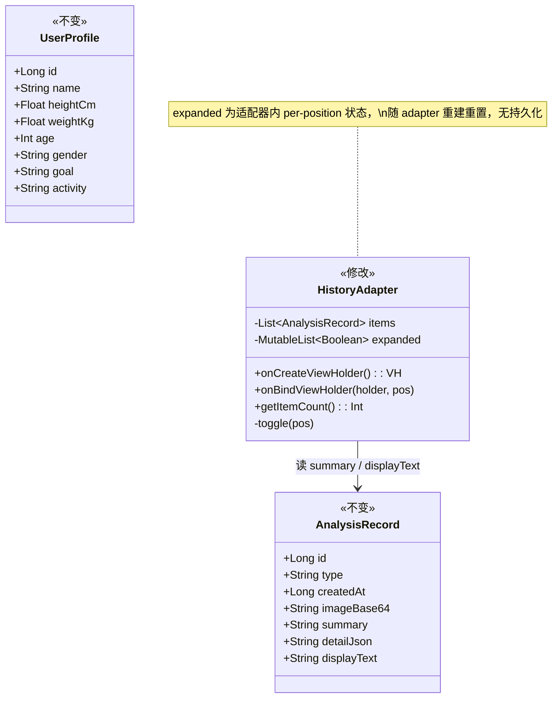
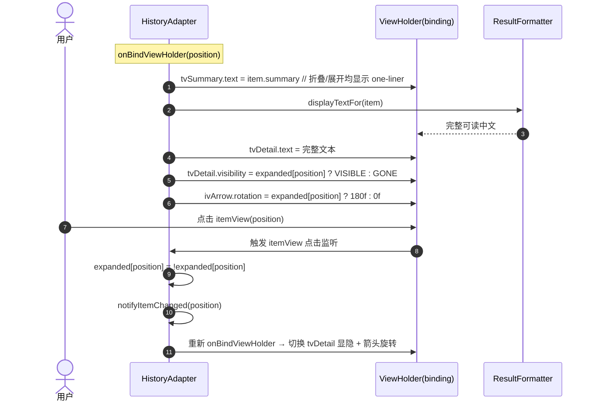
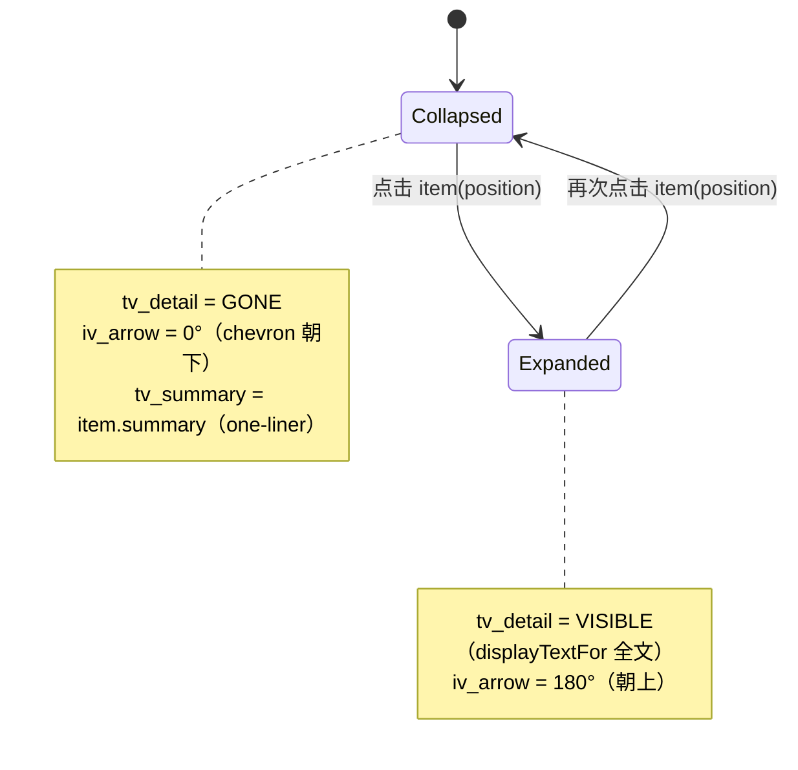
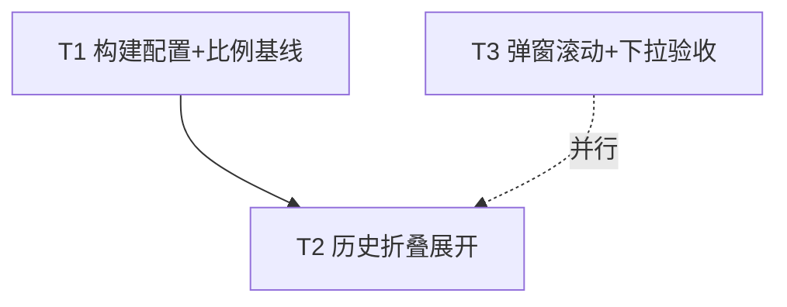

# HealthAI 2.1 增量架构设计 + 任务分解

> 架构师：高见远 ｜ 项目：HealthAI（原生 Android / Kotlin 1.9.22 / AGP 8.2.2 / Room 2.6.1 / Retrofit 2.9.0 / ViewBinding / Material 3 / BottomNavigationView）
> 范围：**仅本次 5 项增量需求**（R1 图片方向 4:3→3:4、R2 分析页档案下拉回归验收、R3 历史折叠展开、R4 编辑弹窗可滚动、R5 版本号），**不重写系统、不新增数据模型/接口**。
> 本文基于**已读全量相关源码**后产出。配套图：`docs/class-diagram.mermaid`（数据结构/接口）、`docs/sequence-diagram.mermaid`（历史折叠展开时序）。

---

## 1. 实现方案 + 框架选型（最小变更策略）

### 1.1 总体策略
在已确认现状（2.0 已落地：多图、多人档案、ResultFormatter、下拉选人等均已存在）基础上，采取**纯增量、局部 XML 属性 + 适配器/片段局部逻辑**的路线。复用既有 `ViewBinding`、`RecyclerView`、`MaterialAlertDialogBuilder`、`AppPreferences`、`ResultFormatter`、`ImageUtils` 等能力，**不引入任何新第三方依赖、不改动 Room 表结构与任何实体字段**。

### 1.2 各难点与最小变更方案
| 需求 | 难点 | 最小变更方案 |
|---|---|---|
| **R1 图片方向** | 网格缩略、历史缩略均为 `4:3`（偏宽），需统一改为 `3:4`（竖:横=4:3，偏高） | 仅改 3 处 `app:layout_constraintDimensionRatio`： • `item_image_thumb.xml` 的 `iv_thumb`、`tv_add` • `item_history.xml` 的 `iv_thumb` 纯 XML 属性修改，无 Kotlin 改动（`ImageThumbAdapter`/`HistoryAdapter` 已消费该约束） |
| **R2 下拉回归验收** | 下拉（`MaterialAutoCompleteTextView @+id/auto_profile`）已存在，本次目标是确认可用、无隐藏缺口 | 仅**回归验收**：确认 `Body/FoodAnalysisFragment.loadProfilesAndSetupDropdown()` 能弹出、列出全档案+「通用建议(0L)」、默认跟随 `activeProfileId`/首个建档人、`setOnItemClickListener` 能设 `selectedProfileId` 且仅本次分析生效（不写回 `activeProfileId`）。发现缺口才修，无则保持 |
| **R3 历史折叠展开** | 当前 `itemView` 点击 → `HistoryFragment.showDetail()` 弹 Dialog（全文）；需改为**内联折叠/展开**，移除 Dialog | ① `item_history.xml` 加 `tv_detail`(默认 `gone`) + 箭头 `iv_arrow`；② `HistoryAdapter` 维护 per-position `expanded` 状态，点击 `itemView` 切换该位置显隐 + 箭头旋转，不再回调 `showDetail`；③ `HistoryFragment` 移除 `showDetail()` 与 `MaterialAlertDialogBuilder` |
| **R4 编辑弹窗可滚动** | `dialog_profile_edit.xml` 根 `LinearLayout` 无 `ScrollView`，字段多时小屏被截断 | 根 `LinearLayout` 外包一层 `<ScrollView android:fillViewport="true">`，内部 `LinearLayout` 及所有子控件 `id` 不变 → `ProfileFragment` 视图绑定（`DialogProfileEditBinding`）无需改 |
| **R5 版本号** | `versionCode`/`versionName` 需提升 | `build.gradle.kts`：`versionCode 2→3`、`versionName "2.0"→"2.1"` |

### 1.3 R3「expanded 状态」维护方式（重点）
- **方案**：在 `HistoryAdapter` 内新增字段 `private val expanded: MutableList<Boolean> = MutableList(items.size) { false }`（与 `items` 同序，初始全 `false`）。
- **理由**：最轻量、零额外类；随 Adapter 生命周期存在。`HistoryFragment.load()` 每次 `onResume` 都会 `recreate` 一个新 `HistoryAdapter`，故 expanded 状态天然随列表刷新重置——这正符合「无需持久化、每次进入历史页默认折叠」的需求。
- **备选**（若工程师偏好）：包装类 `data class HistoryItem(val record: AnalysisRecord, var expanded: Boolean)` 或 `SparseBooleanArray`。推荐 `MutableList<Boolean>`，改动最小。
- **交互**：`onBindViewHolder` 中按 `expanded[position]` 设置 `tvDetail.visibility` 与 `ivArrow.rotation`；`itemView.setOnClickListener` 内 `expanded[position] = !expanded[position]; notifyItemChanged(position)`（局部刷新，性能优）。

### 1.4 框架/库选型结论
- **UI**：ViewBinding + Material 3 + RecyclerView（沿用）；折叠展开用原生 `notifyItemChanged` + `View.rotation`（AndroidX core 已提供），无需 Epoxy 等第三方库。
- **架构模式**：保持现有「Fragment + RecyclerView.Adapter + Room DAO」轻量结构，**不引入新架构层**。
- **新依赖**：**无**（见 §6）。`build.gradle.kts` 仅改 `versionCode/versionName`，`dependencies` 块不变。

---

## 2. 文件列表（本次 新增｜修改）

| 路径 | 标记 | 对应需求 | 改动要点 |
|---|---|---|---|
| `app/build.gradle.kts` | 修改 | R5 | `versionCode 2→3`、`versionName "2.0"→"2.1"` |
| `app/src/main/res/layout/item_image_thumb.xml` | 修改 | R1 | `iv_thumb`、`tv_add` 的 `app:layout_constraintDimensionRatio="4:3"` → `"3:4"` |
| `app/src/main/res/layout/item_history.xml` | 修改 | R1 + R3 | `iv_thumb` 比例 `4:3→3:4`；新增 `tv_detail`(默认 gone) 与末尾箭头 `iv_arrow` |
| `app/src/main/res/drawable/ic_chevron_down.xml` | **新增** | R3 | 24×24 矢量 chevron-down（tint `?attr/colorControlNormal`），仅资源、无依赖 |
| `app/src/main/java/com/example/healthai/ui/HistoryAdapter.kt` | 修改 | R3 | 新增 `expanded` 状态；重写 `onBindViewHolder`（tvSummary=item.summary、tvDetail=displayTextFor、按 expanded 切换显隐与箭头旋转）；`itemView` 点击切换 expanded；移除 `onClick` 回调 |
| `app/src/main/java/com/example/healthai/ui/HistoryFragment.kt` | 修改 | R3 | 移除 `showDetail()` 与 `MaterialAlertDialogBuilder`；adapter 构造去掉 `onClick` 参数 |
| `app/src/main/res/layout/dialog_profile_edit.xml` | 修改 | R4 | 根 `LinearLayout` 外包 `<ScrollView android:fillViewport="true">`，内部 LinearLayout 及所有子控件 `id` 不变 |
| `app/src/main/java/com/example/healthai/ui/BodyAnalysisFragment.kt` | 修改（仅验收，通常不改） | R2 | 确认 `loadProfilesAndSetupDropdown()` 正常；若有隐藏缺口则修 |
| `app/src/main/java/com/example/healthai/ui/FoodAnalysisFragment.kt` | 修改（仅验收，通常不改） | R2 | 同上对称逻辑 |

> **不变文件（已核对确认无需改动）**：`data/AnalysisRecord.kt`、`data/UserProfile.kt`、`data/AppDatabase.kt`、`util/ResultFormatter.kt`、`util/ImageUtils.kt`、`MainActivity.kt`、`ProfileFragment.kt`（R4 不改其绑定）、`fragment_body.xml`/`fragment_food.xml`（下拉已存在）。

---

## 3. 数据结构 / 接口

### 3.1 结论
- **无新增数据实体、无接口签名变更**。`AnalysisRecord`、`UserProfile` 字段保持不变，`AnalysisRecordDao`/`UserProfileDao`/`AppDatabase` 保持不变（schema 未变，`versionCode` 提升不触发 Room 迁移）。
- **唯一新增的「状态容器」** 是 `HistoryAdapter` 内的局部字段 `expanded: MutableList<Boolean>`，仅在运行时存在，不入库、不跨页面。

### 3.2 类图（详见 `docs/class-diagram.mermaid`）

> 说明：`UserProfile` 仅列出以明「不变」；本次 R3 不引用它。完整 2.0 类关系见历史文档，本次无结构性变化故不再展开。

---

## 4. 程序调用流程（时序 / 状态）

> 完整 Mermaid 见 `docs/sequence-diagram.mermaid`（历史折叠展开时序图）。

### 4.1 历史折叠展开链路（R3，核心）

### 4.2 状态机（折叠 ↔ 展开）

### 4.3 R2 下拉（已存在，本次仅验收）
- `Body/FoodAnalysisFragment.loadProfilesAndSetupDropdown()` 已在 `onViewCreated` 调用：
  1. 协程内 `userProfileDao().getAll()` + `AppPreferences.getActiveProfileId()`；
  2. 默认 `effectiveId`：active 存在→active；否则有人建档→首个建档人（并 `setActiveProfileId`）；否则 `0L`（通用建议）；
  3. 构造 `options = [通用建议(0L)] + 全档案`，`ArrayAdapter` 设入 `autoProfile`；
  4. `autoProfile.setText(selectedName, false)` 设默认；`setOnItemClickListener` 设局部 `selectedProfileId`（**不写回** `activeProfileId`）。
- 本次**不作为开发任务**，仅回归验收（见 T3）。若实测发现下拉不弹/选择无反应等隐藏缺口，按「保持不写回」前提修 `Body/FoodAnalysisFragment`，逻辑不变则保持。

### 4.4 移除的调用
- `HistoryFragment.showDetail()` 及其 `MaterialAlertDialogBuilder` 调用**删除**；原 `HistoryAdapter(list) { showDetail(it) }` 改为 `HistoryAdapter(list)`（无 `onClick` 参数）。

---

## 5. 任务列表（有序、含依赖、验收点）

> 任务数 ≤ 5，按模块内聚分组；每个任务均覆盖 ≥ 3 个相关文件。R4（单文件）与 R2（双文件）合并为 T3，因其均属「UI 验收/适配类、几乎无逻辑改动」。

### T1 ｜ 构建配置与全局缩略比例基线（基础设施）
- **涉及文件**：
  - `app/build.gradle.kts` 【修改】— R5 版本号
  - `app/src/main/res/layout/item_image_thumb.xml` 【修改】— R1（两处 `4:3→3:4`）
  - `app/src/main/res/layout/item_history.xml` 【修改】— R1（`iv_thumb` `4:3→3:4`）
- **依赖**：无（首个任务，建立资源/配置基线）
- **优先级**：P0
- **验收点**：
  - `versionCode = 3`、`versionName = "2.1"`
  - `item_image_thumb.xml` 的 `iv_thumb`、`tv_add` 的 `layout_constraintDimensionRatio` 均为 `3:4`
  - `item_history.xml` 的 `iv_thumb` 比例为 `3:4`
  - 编译通过、无资源错误；分析页网格缩略变为竖图、历史缩略变竖图

### T2 ｜ 历史折叠展开（R3）
- **涉及文件**：
  - `app/src/main/res/drawable/ic_chevron_down.xml` 【新增】— 箭头矢量（24dp chevron-down，tint `?attr/colorControlNormal`，无新依赖）
  - `app/src/main/res/layout/item_history.xml` 【修改】— 在竖排信息区加 `tv_detail`(默认 `gone`)，末尾加 `iv_arrow`；`iv_thumb` 比例保持 T1 的 `3:4`
  - `app/src/main/java/com/example/healthai/ui/HistoryAdapter.kt` 【修改】— 增 `expanded: MutableList<Boolean>`；`onBindViewHolder` 设 `tvSummary=item.summary`、`tvDetail=ResultFormatter.displayTextFor(item)` 并按 `expanded[pos]` 切换 `tvDetail` 显隐与 `ivArrow` 旋转；`itemView` 点击切换 `expanded[pos]` 并 `notifyItemChanged(pos)`；移除 `onClick` 回调
  - `app/src/main/java/com/example/healthai/ui/HistoryFragment.kt` 【修改】— 移除 `showDetail()` 与 `MaterialAlertDialogBuilder`；adapter 构造改为无 `onClick` 参数
- **依赖**：T1（`item_history.xml` 比例先就位）
- **优先级**：P0
- **验收点**：
  - 默认折叠：显示「照片 + tv_summary(=item.summary) + 时间 + 类型 + 朝下箭头」，tv_detail 不可见
  - 点击项 → 内联展开：tv_detail 显示完整 `displayTextFor(item)`，箭头旋转 180° 朝上
  - 再次点击 → 折叠回默认
  - 历史页**不再弹出**详情 Dialog
  - 旧记录（`displayText` 为空）经 `ResultFormatter` 回退正常显示全文

### T3 ｜ 编辑弹窗可滚动 + 下拉回归验收（R4 + R2）
- **涉及文件**：
  - `app/src/main/res/layout/dialog_profile_edit.xml` 【修改】— R4：根 `LinearLayout` 外包 `<ScrollView android:fillViewport="true">`，内部 `LinearLayout` 及所有子控件 `id` 不变
  - `app/src/main/java/com/example/healthai/ui/BodyAnalysisFragment.kt` 【修改（仅验收，通常不改）】— R2：确认 `loadProfilesAndSetupDropdown()` 下拉可弹出、列出全档案+「通用建议(0L)」、默认跟随 `activeProfileId`/首个建档人、点击设 `selectedProfileId` 且仅本次分析生效（不写回 `activeProfileId`）；若有隐藏缺口则修
  - `app/src/main/java/com/example/healthai/ui/FoodAnalysisFragment.kt` 【修改（仅验收，通常不改）】— R2：对称逻辑同上
- **依赖**：无（与 T2 互不耦合，可并行）
- **优先级**：P1
- **验收点**：
  - **R4**：档案字段较多时弹窗可滚动查看全部字段；字段 `id`/顺序/校验不变；`ProfileFragment` 视图绑定无需改动、编译通过
  - **R2**：身材/食物页下拉均能弹出并列出「通用建议」+全档案；选择后 `selectedProfileId` 生效、`activeProfileId` 不变；默认项跟随 `activeProfileId`/首个建档人或通用建议

### 任务依赖图

---

## 6. 依赖包列表

**本次不引入任何新第三方依赖。** 完全沿用既有：`room 2.6.1`、`retrofit2 2.9.0`、`okhttp 4.12.0`、`gson 2.10.1`、`kotlinx-coroutines-android 1.7.3`、`material 1.11.0`、`constraintlayout 2.1.4`、`recyclerview 1.3.2`、`lifecycle 2.7.0`。`build.gradle.kts` 仅改 `versionCode/versionName`，`dependencies` 块不变。新增的 `ic_chevron_down.xml` 为项目内矢量资源，非依赖。

---

## 7. 共享约定（跨文件）

1. **折叠态文本**：`tv_summary` 显示 `item.summary`（one-liner；身材= `result.overall`，食物= 食物名拼接）。
2. **展开态文本**：`tv_detail` 显示 `ResultFormatter.displayTextFor(item)`（完整可读中文，含首行；允许与 summary 轻微重复，不剥离）。
3. **箭头旋转方向**：折叠 `0°`（chevron 朝下），展开 `180°`（朝上）；用 `View.rotation` / `ViewCompat.setRotation` 实现。
4. **缩略比例统一 `3:4`**（竖:横 = 4:3，偏高）：覆盖网格 `item_image_thumb` 的 `iv_thumb`、`tv_add` 与历史 `item_history` 的 `iv_thumb`。
5. **下拉选择不写回** `activeProfileId`：`selectedProfileId` 为 Fragment 局部变量，仅本次分析生效；`activeProfileId` 仅由 `ProfileFragment` 的「设为当前」写入。
6. **数据模型不变**：`AnalysisRecord`/`UserProfile` 字段不变，`versionCode` 提升不触发 Room 迁移（schema 未变）。
7. **无新依赖**：沿用现有原生栈与 Material 3。

---

## 8. 待明确事项（设计层面仍需工程师落地决策）

1. **箭头图标取用**：方案建议**新增矢量** `ic_chevron_down.xml` 以保证 tint 与主题一致（无依赖）；也可直接复用系统 `@android:drawable/arrow_down_float`。由工程师据视觉一致性择一。
2. **`tv_detail` 展示限制**：设计不限制行数/最大高度，按 `displayTextFor(item)` 原文完整显示；若产品希望限制高度并加「展开全文」二级交互，属额外需求，本次不做。
3. **展开态持久化**：当前每次 `onResume` 重建 adapter，expanded 重置为全折叠。设计判定「无需持久化」符合需求；若产品要求离开再回来保持展开态，需额外存储（非本次范围）。
4. **R2 隐藏缺口修复手法**：若实测发现某些 ROM 下 `MaterialAutoCompleteTextView` 点击无响应/不弹，具体修复（如手动 `showDropDown()`、调整 `inputType` 等）由工程师在**保持不写回 activeProfileId** 前提下决定。
5. **编辑弹窗 ScrollView 高度策略**：`ScrollView` 用 `android:layout_height="wrap_content"` 或 `match_parent` + `fillViewport="true"` 均可，由工程师据对话框实测宽度/高度决定；内部 `LinearLayout` 保持 `wrap_content`。
