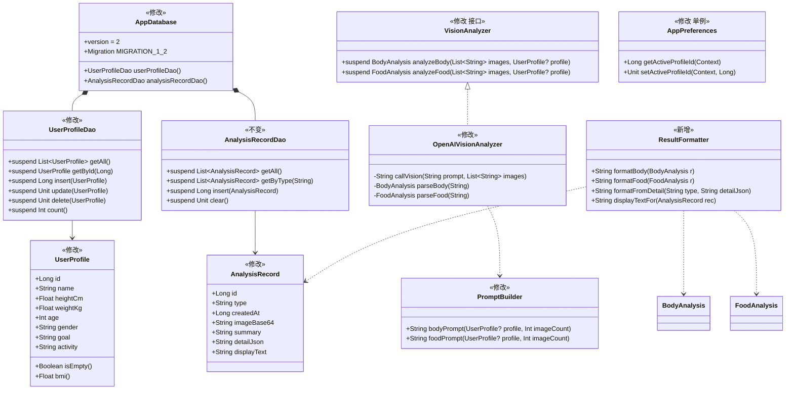
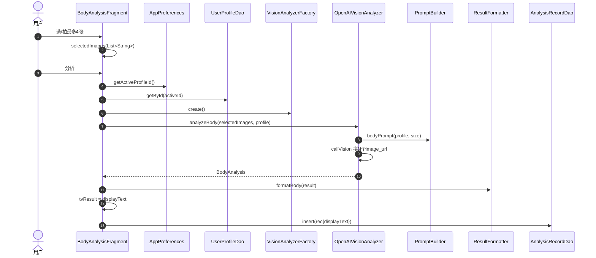
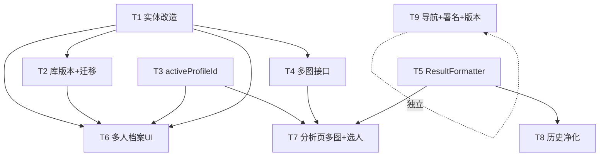

# HealthAI 2.0 增量架构设计 + 任务分解

> 架构师：高见远 ｜ 项目：HealthAI（原生 Android / Kotlin 1.9.22 / AGP 8.2.2 / Room 2.6.1 / Retrofit / ViewBinding / Material 3 / BottomNavigationView）
> 范围：**仅本次 5 项增量需求**（R1 多图分析、R2 多人档案、R3 设置右移+署名、R4 历史净化、R5 版本号），不重写整体系统。
> 配套图：`docs/class-diagram.mermaid`、`docs/sequence-diagram.mermaid`。

---

## 1. 实现方案 + 框架选型（最小变更策略）

### 1.1 总体策略
在**已读全量源码**基础上，采取"加列 + 接口扩展 + 局部重写 UI"的增量路线，复用 `ImageUtils` 压缩、`AppPreferences`(SharedPreferences)、`VisionAnalyzerFactory`、`models.kt`、`JsonExt.kt` 等既有能力，**不引入任何新第三方依赖**。

### 1.2 各难点与选型
| 难点 | 最小变更方案 | 说明 |
|---|---|---|
| **R2 多人档案（Room 表结构变更）** | `UserProfile` 由「`@PrimaryKey id=1` 单表」改为「`@PrimaryKey(autoGenerate=true) id` + `name` 多行表」；`UserProfileDao` 由单查 `get()` 改为 `getAll/getById/insert/update/delete/count` | 主键由固定值变自增，需重建表，故走 **Migration** 而非 `fallbackToDestructiveMigration` |
| **R4 历史不丢（迁移策略）** | `AppDatabase` `version 1→2`，手写 `MIGRATION_1_2`：<br>① 重建 `user_profile` 为多行表并迁移旧单行；<br>② `analysis_records` 用 `ALTER TABLE ... ADD COLUMN displayText TEXT NOT NULL DEFAULT ''` | 旧记录 `displayText=''`→详情/卡片回退 `ResultFormatter` 美化，满足"不破坏性迁移、不丢旧历史" |
| **R1 多图分析** | `VisionAnalyzer.analyzeBody/Food` 形参 `String`→`List<String>`；`OpenAIVisionAnalyzer.callVision` 为每张图拼一个 `image_url` content block；`PromptBuilder` 改多图版提示词 | OpenAI 兼容 `chat/completions` 原生支持多 `image_url`，改动小 |
| **R1 4:3 图片框** | `iv_preview/iv_food_preview` 单 `ImageView` → 水平 `RecyclerView`（最多 4 张 4:3 缩略 + 添加格），`item_image_thumb.xml` 用 `ConstraintLayout` + `layout_constraintDimensionRatio="4:3"` 统一比例 | 复用 `centerCrop` 习惯，比例用约束实现，无需自写自定义 View |
| **R2 选人持久化** | 复用现有 `AppPreferences`（SharedPreferences）新增 `activeProfileId:Long` | 不引入 DataStore 新库（PM 裁定"复用现有 AppPreferences 机制"） |
| **R4 净化函数来源** | 从 `BodyAnalysisFragment.showResult` / `FoodAnalysisFragment.showResult` 提取为 **新增** `util/ResultFormatter.kt` 共享工具 | 分析页结果、历史卡片、历史详情三处统一调用，保证格式一致 |
| **R3 导航重排** | 仅调整 `bottom_nav_menu.xml` 中 `<item>` 顺序（历史移到设置前）；`MainActivity.kt` 监听器按 `id` 分发，**无需改动** | 现状已确认监听器与顺序解耦 |
| **R3 署名** | `fragment_settings.xml` 底部加一个居中灰字 `TextView`，文案写入 `strings.xml` | 仅设置页底部出现 |
| **R5 版本号** | `build.gradle.kts` `versionCode=2`、`versionName="2.0"` | — |

### 1.3 框架/库选型结论
- **数据库**：Room 2.6.1（沿用），版本升 2，手写 Migration，保留 `fallbackToDestructiveMigration()` 作兜底。
- **网络/JSON**：Retrofit + OkHttp + Gson（沿用），仅调 `readTimeout` 90s→120s。
- **UI**：ViewBinding + Material 3 + RecyclerView（沿用），无新控件库。
- **新依赖**：**无**（见 §6）。

---

## 2. 文件列表及相对路径（本次 新增｜修改）

### 2.1 新增文件
| 路径 | 说明 |
|---|---|
| `app/src/main/java/com/example/healthai/util/ResultFormatter.kt` | **新增** 共享结果格式化工具（R4 根因治理） |
| `app/src/main/java/com/example/healthai/ui/ProfileAdapter.kt` | **新增** 多人档案列表适配器（R2） |
| `app/src/main/res/layout/item_profile.xml` | **新增** 档案列表项（名称/关键指标/设为当前/编辑/删除） |
| `app/src/main/res/layout/item_image_thumb.xml` | **新增** 多图选择缩略项（4:3 + 删除按钮） |
| `app/src/main/res/layout/dialog_profile_edit.xml` | **新增** 新增/编辑档案对话框布局（name + 身高/体重/年龄/性别/目标/活动） |

### 2.2 修改文件
| 路径 | 改动要点 |
|---|---|
| `app/src/main/java/com/example/healthai/data/UserProfile.kt` | 自增 `id` + `name` 字段；DAO 改为多行 CRUD |
| `app/src/main/java/com/example/healthai/data/AnalysisRecord.kt` | 新增 `displayText` 列 |
| `app/src/main/java/com/example/healthai/data/AppDatabase.kt` | `version=2` + `MIGRATION_1_2` |
| `app/src/main/java/com/example/healthai/data/AppPreferences.kt` | 新增 `activeProfileId` 存取 |
| `app/src/main/java/com/example/healthai/vision/VisionAnalyzer.kt` | 接口方法 `analyzeBody/Food` 形参改 `List<String>` |
| `app/src/main/java/com/example/healthai/vision/OpenAIVisionAnalyzer.kt` | `callVision` 多图拼接、`readTimeout=120s`、提示词多图版 |
| `app/src/main/java/com/example/healthai/vision/TencentVisionAnalyzer.kt` | 占位实现同步改方法签名 |
| `app/src/main/java/com/example/healthai/util/PromptBuilder.kt` | `bodyPrompt/foodPrompt` 增加 `imageCount` 参数，提示"综合多张" |
| `app/src/main/java/com/example/healthai/ui/BodyAnalysisFragment.kt` | 多图选择 + 档案下拉选人 + 入库带 `displayText` |
| `app/src/main/java/com/example/healthai/ui/FoodAnalysisFragment.kt` | 同上（食物页） |
| `app/src/main/java/com/example/healthai/ui/ProfileFragment.kt` | **重写** 为多人档案管理器 |
| `app/src/main/java/com/example/healthai/ui/HistoryFragment.kt` | 详情改用 `ResultFormatter.displayTextFor` |
| `app/src/main/java/com/example/healthai/ui/HistoryAdapter.kt` | 卡片展示 `displayTextFor` |
| `app/src/main/res/menu/bottom_nav_menu.xml` | 重排：身材→食物→我的→历史→设置 |
| `app/src/main/res/layout/fragment_body.xml` | `iv_preview`→`rv_images`(多图) + `spinner_profile` |
| `app/src/main/res/layout/fragment_food.xml` | `iv_food_preview`→`rv_images` + `spinner_profile` |
| `app/src/main/res/layout/fragment_settings.xml` | 底部加署名 `TextView` |
| `app/src/main/res/values/strings.xml` | 新增署名文案、选人/多人档案相关字符串 |
| `app/build.gradle.kts` | `versionCode=2`、`versionName="2.0"` |

### 2.3 不变文件（确认无需改动）
`MainActivity.kt`（R3 仅改菜单顺序）、`vision/models.kt`、`util/JsonExt.kt`、`util/ImageUtils.kt`、`vision/VisionAnalyzerFactory.kt`、`data/AnalysisRecordDao.kt`、`ui/HistoryAdapter.kt` 的列表结构、`res/menu` 其余。

---

## 3. 数据结构和接口（类图 / 表格）

### 3.1 类图（详见 `docs/class-diagram.mermaid`）


### 3.2 关键实体 / 接口签名（表格）

**① 新 `UserProfile` 实体（R2）**
```kotlin
@Entity(tableName = "user_profile")
data class UserProfile(
    @PrimaryKey(autoGenerate = true) val id: Long = 0,
    val name: String = "",                 // 新增：档案名，允许重名、允许空（UI 显示占位"未命名档案"）
    val heightCm: Float = 0f,
    val weightKg: Float = 0f,
    val age: Int = 0,
    val gender: String = "",               // "male" | "female"
    val goal: String = "",                 // "lose" | "maintain" | "gain"
    val activity: String = ""              // "low" | "mid" | "high"
) {
    fun isEmpty(): Boolean =
        heightCm <= 0 || weightKg <= 0 || gender.isBlank() || goal.isBlank()
    fun bmi(): Float? { /* 沿用现有实现 */ }
}

@Dao
interface UserProfileDao {
    @Query("SELECT * FROM user_profile ORDER BY id ASC")
    suspend fun getAll(): List<UserProfile>
    @Query("SELECT * FROM user_profile WHERE id = :id")
    suspend fun getById(id: Long): UserProfile?
    @Insert(onConflict = OnConflictStrategy.REPLACE)
    suspend fun insert(p: UserProfile): Long
    @Update suspend fun update(p: UserProfile)
    @Delete suspend fun delete(p: UserProfile)
    @Query("SELECT COUNT(*) FROM user_profile")
    suspend fun count(): Int
}
```

**② 新 `AnalysisRecord` 实体（R4：新增 `displayText`）**
```kotlin
@Entity(tableName = "analysis_records")
data class AnalysisRecord(
    @PrimaryKey(autoGenerate = true) val id: Long = 0,
    val type: String,                       // "body" | "food"
    val createdAt: Long,
    val imageBase64: String = "",           // 多图时取首图（其余不持久化）
    val summary: String = "",               // 原中文短摘要（保留）
    val detailJson: String = "",            // 结构化 JSON（保留，向后兼容）
    val displayText: String = ""            // ★新增：可读中文；为空时回退 ResultFormatter
)
// AnalysisRecordDao 接口保持不变（getAll/getByType/insert/clear）
```

**③ 改造后 `VisionAnalyzer` 接口（R1 多图）**
```kotlin
interface VisionAnalyzer {
    suspend fun analyzeBody(images: List<String>, profile: UserProfile?): BodyAnalysis
    suspend fun analyzeFood(images: List<String>, profile: UserProfile?): FoodAnalysis
}
```
- `OpenAIVisionAnalyzer.analyzeBody(images, profile)` → `callVision(PromptBuilder.bodyPrompt(profile, images.size), images)`
- `callVision(prompt, images: List<String>)`：构建 1 个 `text` block + 对 `images` 每个元素各 1 个 `image_url` block。
- `readTimeout` 由 `90` → `120` 秒。

**④ `AppPreferences` 新增 `activeProfileId`（R2 选人持久化）**
```kotlin
object AppPreferences {
    // ... 既有 apiKey/apiBase/model 不变 ...
    private const val KEY_ACTIVE_PROFILE = "active_profile_id"
    fun getActiveProfileId(context: Context): Long =
        prefs(context).getLong(KEY_ACTIVE_PROFILE, 0L)   // 0 = 未指定/通用
    fun setActiveProfileId(context: Context, id: Long) =
        prefs(context).edit().putLong(KEY_ACTIVE_PROFILE, id).apply()
}
```

**⑤ 新增 `ResultFormatter` 共享工具（R4 根因治理）**
```kotlin
object ResultFormatter {
    /** 身材结果 → 可读中文（提取自 BodyAnalysisFragment.showResult 逻辑） */
    fun formatBody(r: BodyAnalysis): String
    /** 食物结果 → 可读中文（提取自 FoodAnalysisFragment.showResult 逻辑） */
    fun formatFood(r: FoodAnalysis): String
    /** 旧记录回退：用 Gson 解析 detailJson → BodyAnalysis/FoodAnalysis → 对应 format */
    fun formatFromDetail(type: String, detailJson: String): String
    /** 统一入口：displayText 非空直接返回，否则回退 formatFromDetail */
    fun displayTextFor(rec: AnalysisRecord): String =
        rec.displayText.ifBlank { formatFromDetail(rec.type, rec.detailJson) }
}
```

---

## 4. 程序调用流程（时序图 / 步骤）

> 完整 Mermaid 见 `docs/sequence-diagram.mermaid`。以下为要点。

### 4.1 多图分析流程（身材页，食物页同理）
1. 用户逐张拍照/选图 → `ImageUtils.uriToCompressedBase64` → 追加到 `selectedImages:List<String>` 与 `selectedUris:List<Uri>`（上限 4）。
2. 点击分析：`selectedImages` 空 或 未配 Key → 现有 Toast 拦截。
3. 读 `AppPreferences.getActiveProfileId()` → `UserProfileDao.getById(activeId)`（无则取首个 / `null`）。
4. `VisionAnalyzerFactory.create` → `analyzer.analyzeBody(selectedImages, profile)`。
   - 内部：`PromptBuilder.bodyPrompt(profile, size)` → `callVision(prompt, images)` 拼 N 个 `image_url` → 解析 `parseBody` → `BodyAnalysis`。
5. `ResultFormatter.formatBody(result)` → `displayText`。
6. `tvResult.text = displayText`；构造 `AnalysisRecord(imageBase64=selectedImages[0], detailJson=Gson(result), displayText=displayText)` → `AnalysisRecordDao.insert`。

### 4.2 分析页选人 → 传 profile → 分析 → 存 displayText
- `onViewCreated`：`UserProfileDao.getAll()` 填充下拉；`getActiveProfileId()`：
  - `!=0` 且该人存在 → 默认选中；
  - `==0` 且有人建档 → `setActiveProfileId(firstId)`（默认第一个建档人）；
  - 无人建档 → 下拉默认"通用建议（不指定）" → `profile=null`（与现状一致）。
- 用户选择某人/保持通用 → 分析时带入对应 `profile`（见 4.1）。

### 4.3 历史净化（R4）
- `HistoryFragment.load()` → `AnalysisRecordDao.getAll()` → `HistoryAdapter` 绑定。
- 卡片/详情文本统一调用 `ResultFormatter.displayTextFor(rec)`：
  - `rec.displayText` 非空 → 直接展示；
  - 为空（旧记录）→ `formatFromDetail(type, detailJson)` 经 Gson 解析后用 `formatBody/formatFood` 生成可读中文（去除 `{} : " ` 及英文键）。
- `showDetail` 改用 `displayTextFor` 替代原 `rec.detailJson` 直显。

### 4.4 多人档案管理（R2）
- `ProfileFragment`：`getAll()` 绑定 `ProfileAdapter`；「新增」先 `count()`，`>=10` 禁用并 Toast；对话框（`dialog_profile_edit.xml`）填写 name+指标 → `insert`；`activeId==0` 时自动 `setActiveProfileId(newId)`。
- 「设为当前」→ `setActiveProfileId(id)`；删除 → `delete`，若删的是 active 则 `activeId=0`（下次默认首个建档人）。



---

## 5. 任务列表（有序、含依赖、验收点）

> 粒度细化到工程师可直接落地。依赖为"前置任务 ID"。T9 与数据层无耦合，可并行。

### T1 ｜ 数据实体改造（UserProfile 多行 + AnalysisRecord.displayText）
- **涉及文件**：`data/UserProfile.kt`、`data/AnalysisRecord.kt`
- **依赖**：无
- **验收**：`UserProfile` 为自增 `id` + `name` 多行实体；`UserProfileDao` 提供 `getAll/getById/insert/update/delete/count`；`AnalysisRecord` 含 `displayText` 且默认 `""`；编译通过。

### T2 ｜ 数据库版本升级 + 迁移（v1→v2，不丢历史）
- **涉及文件**：`data/AppDatabase.kt`
- **依赖**：T1
- **验收**：`version=2`；`MIGRATION_1_2` 重建 `user_profile`（迁移旧单行，name 置 `""`）并 `ALTER` `analysis_records ADD COLUMN displayText`；保留 `fallbackToDestructiveMigration()` 兜底；用旧版数据库升级后历史不丢、`displayText` 为空。

### T3 ｜ AppPreferences 增加 activeProfileId
- **涉及文件**：`data/AppPreferences.kt`
- **依赖**：无
- **验收**：`get/setActiveProfileId` 正确持久化；默认值 `0` 表示未指定。

### T4 ｜ VisionAnalyzer 多图接口 + PromptBuilder 多图提示词 + 实现改造
- **涉及文件**：`vision/VisionAnalyzer.kt`、`vision/PromptBuilder.kt`、`vision/OpenAIVisionAnalyzer.kt`、`vision/TencentVisionAnalyzer.kt`
- **依赖**：T1
- **验收**：`analyzeBody/Food` 接收 `List<String>`；`callVision` 为每张图拼 1 个 `image_url`；`PromptBuilder.bodyPrompt/foodPrompt` 增加 `imageCount` 并要求"综合多张照片联合判断"；`OpenAIVisionAnalyzer.readTimeout=120s`；`TencentVisionAnalyzer` 签名同步（仍抛未实现）。

### T5 ｜ ResultFormatter 共享工具
- **涉及文件**：`util/ResultFormatter.kt`【新增】
- **依赖**：无（依赖既有 `models.kt`）
- **验收**：`formatBody/formatFood` 由 `showResult/showFoodResult` 逻辑提取，输出可读中文；`formatFromDetail` 用 Gson 解析 `detailJson` 后格式化；`displayTextFor` 正确回退；去除 `{} : " ` 及英文键。

### T6 ｜ 多人档案 UI 重写
- **涉及文件**：`ui/ProfileFragment.kt`【重写】、`ui/ProfileAdapter.kt`【新增】、`res/layout/item_profile.xml`【新增】、`res/layout/dialog_profile_edit.xml`【新增】
- **依赖**：T1、T2、T3
- **验收**：列表展示全部档案；可新增/编辑/删除；总数 `>=10` 时禁用新增并 Toast；空名显示"未命名档案"；「设为当前」写 `activeProfileId`；删 active 后回退首个建档人。

### T7 ｜ 分析页多图 + 选人改造
- **涉及文件**：`ui/BodyAnalysisFragment.kt`、`ui/FoodAnalysisFragment.kt`、`res/layout/fragment_body.xml`、`res/layout/fragment_food.xml`、`res/layout/item_image_thumb.xml`【新增】
- **依赖**：T1、T3、T4、T5
- **验收**：图片框 4:3、最多 4 张、删除单张；选人下拉（含"通用建议"）默认跟随 `activeProfileId`/首个建档人；空图拦截；调用新 `analyzeBody/Food(images, profile)`；结果用 `displayText` 展示；入库含 `displayText` 与首图 `imageBase64`。

### T8 ｜ 历史净化
- **涉及文件**：`ui/HistoryFragment.kt`、`ui/HistoryAdapter.kt`
- **依赖**：T5
- **验收**：卡片与详情统一 `ResultFormatter.displayTextFor`；旧记录经回退变可读中文；新记录直显 `displayText`；原 `{} : " ` 及英文键不再出现。

### T9 ｜ 导航重排 + 设置署名 + 版本号
- **涉及文件**：`res/menu/bottom_nav_menu.xml`、`res/layout/fragment_settings.xml`、`res/values/strings.xml`、`build.gradle.kts`
- **依赖**：无（独立，可并行）
- **验收**：导航顺序 身材→食物→我的→历史→设置；设置页底部居中灰字"APP开发者：刘乐清 - 大境初级中学"；`versionCode=2`、`versionName="2.0"`。

### 依赖关系图


---

## 6. 依赖包列表
**本次不引入任何新依赖。** 沿用既有：`room 2.6.1`、`retrofit2 2.9.0`、`okhttp 4.12.0`、`gson 2.10.1`、`kotlinx-coroutines-android 1.7.3`、`material 1.11.0`、`constraintlayout 2.1.4`、`recyclerview 1.3.2`、`lifecycle 2.7.0`。`build.gradle.kts` 仅改 `versionCode/versionName`，`dependencies` 块不变。

---

## 7. 共享知识（跨文件约定）

1. **`displayText` 生成时机**：分析**成功**时，由 `ResultFormatter.formatBody/Food(result)` 生成，与 `detailJson=Gson(result)`、`imageBase64=首图` 一起随 `AnalysisRecord` `insert`。历史详情/卡片只消费 `displayText`，不碰 `detailJson`。
2. **多图 base64 拼接约定**（`OpenAIVisionAnalyzer.callVision`）：对 `images: List<String>` 每个元素生成一个 `{"type":"image_url","image_url":{"url":"data:image/jpeg;base64,$it"}}` content block；`text` block 仅 1 个（在首部）。顺序即用户所选顺序。
3. **4:3 统一实现**：每个图片 cell 用 `androidx.constraintlayout.widget.ConstraintLayout` 包裹 `ImageView`，`app:layout_constraintDimensionRatio="4:3"` + 宽度固定/`height=0dp`（或 `width=0dp` + `ratio="H,4:3"`），`scaleType="centerCrop"`。主预览 `RecyclerView` 与 `item_image_thumb`、历史缩略统一此模式。
4. **profile 空值语义**：`selectedProfileId==0` 或对应档案不存在 → 传 `null` → `PromptBuilder.profileBlock` 走"未提供档案，给通用建议"分支；**无人建档时与现状完全一致**（通用建议）。
5. **多图存储**：`AnalysisRecord.imageBase64` 取 `selectedImages[0]` 作为历史缩略图，其余图不持久化（旧记录兼容不变）。
6. **activeProfileId 默认 `0`** = 未指定/通用；`ProfileFragment` 在 `activeId==0` 且有人建档时，首次载入自动设为第一个建档人 ID。
7. **多人档案约束**：允许重名；最多 10 人（`count()>=10` 禁用新增并 Toast）；删除当前 active 后 `activeId` 置 0，下次默认首个建档人。
8. **多图失败策略**：整批失败即报错，不做降级（沿用现有 `catch` → Toast「分析失败：…」）。
9. **历史兼容**：旧记录 `displayText=''` → `displayTextFor` 回退 `formatFromDetail`，**不破坏、不迁移旧数据**。

---

## 8. 待明确事项（设计层面仍需工程师落地决策）

1. **多图历史缩略的"N 张"标识**：当前设计仅存首图 `imageBase64`，卡片无法显示"共 N 张"（数量未持久化）。若需角标，建议后续给 `AnalysisRecord` 加 `imageCount` 列——**本次未加**，请工程师确认是否要补该列。
2. **多图请求体体积**：4 张各 `maxDim=1024/quality=80` 的 JPEG base64 可能较大；`readTimeout` 已提至 120s，但需在真机验证目标服务商（OpenAI / 兼容网关）对单请求图片数与体积的限制。
3. **档案编辑对话框实现方式**：设计建议用独立 `dialog_profile_edit.xml` 自定义布局（name + 既有指标字段）；也可 `AlertDialog` 内 inflate，工程师择一落地。
4. **分析页选人控件**：设计建议 `MaterialAutoCompleteTextView`（含"通用建议（不指定）"选项）或 `Spinner`，二者皆可，工程师择一。
5. **空名建档**：设计默认**允许空名**（列表显示"未命名档案"占位）。若产品要求建档必填姓名，需工程师在 `dialog` 校验——请确认是否强制。
6. **`user_profile` 旧单行迁移的 name**：迁移脚本将旧行 `name` 置 `""`，由 `ProfileAdapter` 以占位展示；该占位文案（"未命名档案"）建议写进 `strings.xml`。
7. **`exportSchema`**：本次维持 `false`、手写 Migration；若后续频繁改表，建议开启 `exportSchema=true` 做版本管理（非本次范围）。
